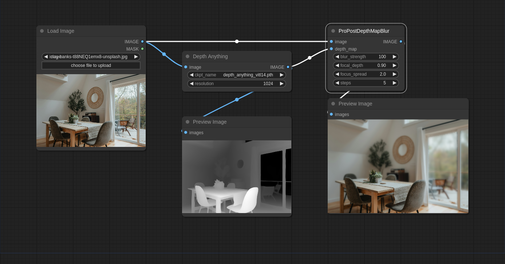
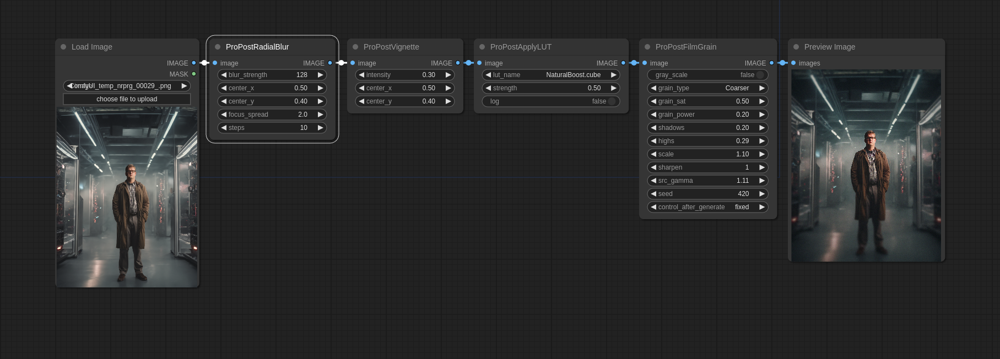

# ComfyUI ProPost

A set of custom ComfyUI nodes for performing basic post-processing effects. These effects can help to take the edge off AI imagery and make them feel more natural. We only have five nodes at the moment, but we plan to add more over time.

## Installation

The easiest way is using the [ComfyUI Manager](https://github.com/ltdrdata/ComfyUI-Manager) to install this package. Just search for `propost` and click install.

### Manual Installation

- Navigate to the `/ComfyUI/custom_nodes/` folder
- Run `git clone https://github.com/digitaljohn/comfyui-propost.git`
- Run `pip install -r requirements.txt`
- Restart ComfyUI

## Nodes

### Film Grain

A film grain effect with many parameters to control the look of the grain. It can create different noise types and patterns, and it can be used to create a variety of film grain looks.

| Parameter   | Default   | Type    | Description                                                                             |
|-------------|-----------|---------|-----------------------------------------------------------------------------------------|
| gray_scale  | `false`   | Boolean | Enables grayscale mode. If true, the output will be in grayscale.                       |
| grain_type  | `Fine`    | String  | Sets the grain type. Values can be Fine, Fine Simple, Coarse, or Coarser.               |
| grain_sat   | `0.5`     | Float   | Grain color saturation, with a range of 0.0 to 1.0.                                     |
| grain_power | `0.7`     | Float   | Overall intensity of the grain effect.                                                  |
| shadows     | `0.2`     | Float   | Intensity of grain in the shadows.                                                      |
| highs       | `0.2`     | Float   | Intensity of grain in the highlights.                                                   |
| scale       | `1.0`     | Float   | Image scaling ratio. Scales the image before applying grain and scales back afterwards. |
| sharpen     | `0`       | Integer | Number of sharpening passes.                                                            |
| src_gamma   | `1.0`     | Float   | Gamma compensation applied to the input.                                                |
| seed        | `1`       | Integer | Seed for the grain random generator.                                                    |

> Note: This code is a direct port/lift of the versatile `Filmgrainer` library available here: https://github.com/larspontoppidan/filmgrainer

### Vignette

A simple vignette effect that darkens the edges of the screen. It supports very subtle vignettes, as well as more pronounced ones.

| Parameter   | Default   | Type    | Description                                                        |
|-------------|-----------|---------|--------------------------------------------------------------------|
| intensity   | `1.0`     | Float   | The intensity of the vignette effect, with a range of 0.0 to 10.0. |
| center_x    | `0.5`     | Float   | The x-coordinate of the center of the vignette. 0.0 to 1.0.        |
| center_y    | `0.5`     | Float   | The y-coordinate of the center of the vignette. 0.0 to 1.0.        |

### Radial Blur

This filter allows you to blur the edges of the image. It has a few different options that allows you to accomplish a variety of effects.

| Parameter            | Default   | Type    | Description                                                                    |
|----------------------|-----------|---------|--------------------------------------------------------------------------------|
| blur_strength        | `64.0`    | Float   | The intensity of the blur at the edges, with a range of 0.0 to 256.0.          |
| center_x             | `0.5`     | Float   | The x-coordinate of the center of the blur. 0.0 to 1.0.                        |
| center_y             | `0.5`     | Float   | The y-coordinate of the center of the blur. 0.0 to 1.0.                        |
| focus_spread         | `1.0`     | Float   | The spread of the area of focus. A larger value makes more of the image sharp. |
| steps                | `5`       | Integer | The number of steps to use when blurring the image. Higher numbers are slower. |

> Note: Using steps set to `1` can create some dreamy effects as seen below with a high edge_blur_strength.

### Depth Map Blur

This filter allows you to blur the image based on a depth map. You can use this in combination with the existing Depth Map nodes like `Depth Anything` or `MiDaS` etc.

#### Example workflow

| Parameter            | Default   | Type    | Description                                                                    |
|----------------------|-----------|---------|--------------------------------------------------------------------------------|
| depth_map            | n/a       | Image   | The depth map to use for the blur.                                             |
| blur_strength        | `64.0`    | Float   | The intensity of the blur, with a range of 0.0 to 256.0.                       |
| focal_depth          | `1.0`     | Float   | The focal depth of the blur. `1.0` is the closest, `0.0` is the farthest.      |
| focus_spread         | `1.0`     | Float   | The spread of the area of focus. A larger value makes more of the image sharp. |
| steps                | `5`       | Integer | The number of steps to use when blurring the image. Higher numbers are slower. |
| focal_range          | `0.0`     | Float   | `1.0` means all areas clear, `0.0` means only focal point is clear.            |
| mask_blur            | `1`       | Integer | Mask blur strength (1 to 127).`1` means no blurring.                           |

### Apply LUT

This filter allows you to apply a 3D LUT to the image. Currently it only supports 3D LUTs in the CUBE format. Upon installation, a sub-folder called `luts` will be created inside `/ComfyUI/models/`. I know it's not strictly a 'model', but it was the best place to put it for now. You can place your `.cube` files in this folder and they will be listed in the node's dropdown.

Here we apply a lut called `Waves.cube` to the image in LOG color space.

| Parameter  | Default | Type    | Description                                                   |
|------------|---------|---------|---------------------------------------------------------------|
| lut_name   | n/a     | LUT     | The `*.cube` from the `luts` folder to apply to the image.    |
| strength   | `1.0`   | Float   | The strength of the LUT effect, with a range of 0.0 to 1.0.   |
| log        | `false` | Boolean | If true, the image is processed in LOG color space.           |

> Note: This code is a heavily inspired from BilboX's work here: https://github.com/syllebra/bilbox-comfyui

## Putting it all together

Obviously due to the nature of ComfyUI you can compose these effects together. Below is an example of a all the effects combined to create a more controlled and striking image.

## Example

Check out this workflow below, which uses the `Film Grain`, `Vignette`, `Radial Blur`, and `Apply LUT` nodes to create the image above. Just drag the image into ComfyUI.

